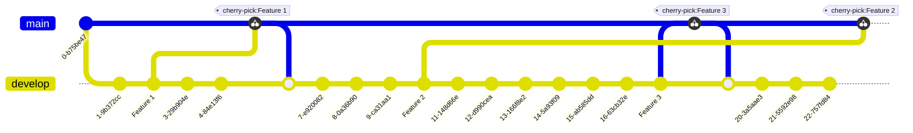

# Commit to Develop

## DONT DO THIS!

```
DONT DO THIS
```

Code changes are commited directly to the develop branch, code can be either cherry-picked or selected from a commit and deployed to a lower level environment. Cherry-picked code is released to production

