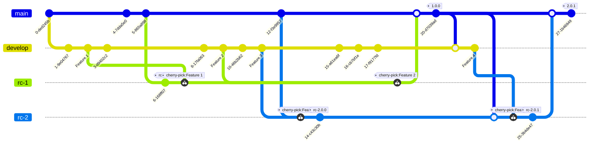

# Commit to Develop with Release Candidates

Code changes are commited directly to the develop branch, release candidates are cherry-picked into releasde candidate branches that track the main branch and delpoyed to lower level environments. Releases are made when release-candidates are merged

