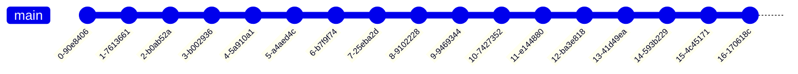

# Commit to Main

## DONT DO THIS!

```
DONT DO THIS
```

Code changes are commited directly to the main branch, code is deployed to lower level environments periodicallly. Code is released to production periodcally.

