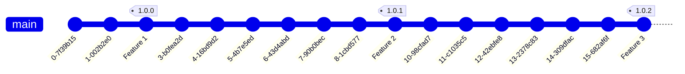

# Commit to Main With Tagging

## DONT DO THIS!

```
DONT DO THIS
```

Code changes are commited directly to the main branch, git tags ares created when features are complete and deployed to lower level environments periodicallly. Git tags are selected and released to production periodcally.

