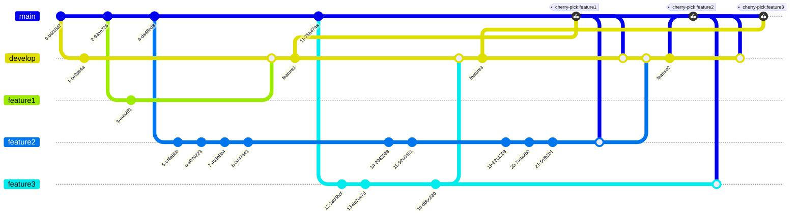

# Current Workflow

Current workflow uses a develop branch. Features are merged into the develop branch, which is deployed to multiple low-level environments. Releases are prepared by cherry-picking merges from the develop branch to the main branch.

