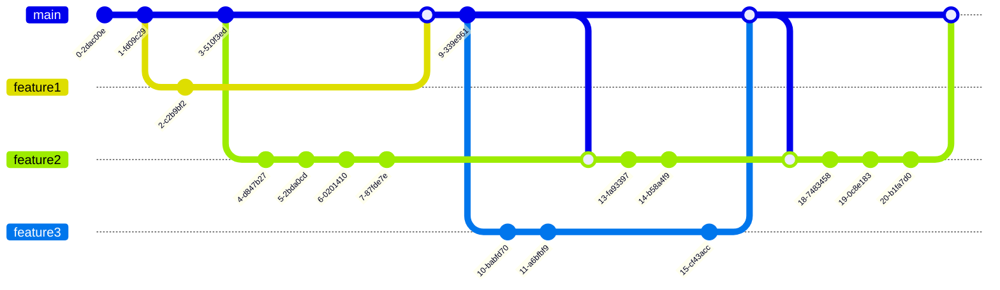

# Feature branches without tagging

Feature branches are merged to the main branch, when this is done a snapshot can be deployed to lower level environments for testing, and released once testing is complete.

