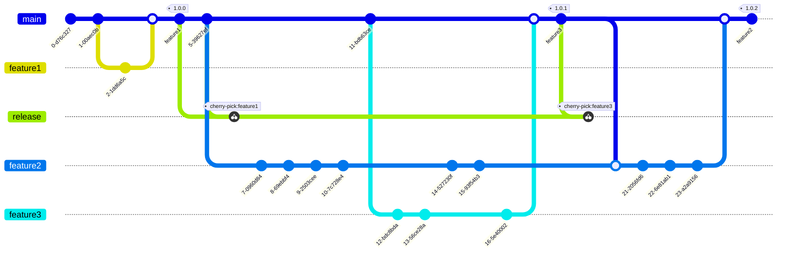

# Feature branches and tagging

Feature branches are merged to the main branch, when this is done a git tag is created. this tag can be deployed to lower level environments for testing, and released once testing is complete.

